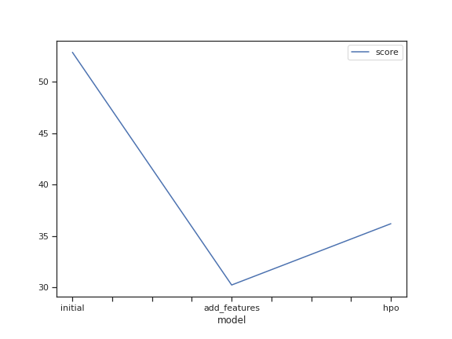
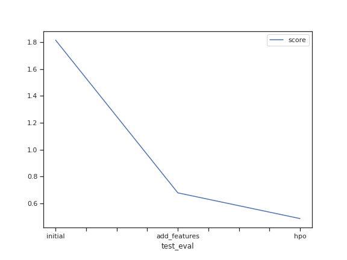

# Report: Predict Bike Sharing Demand with AutoGluon Solution
#### Omar Khalil

## Initial Training
### What did you realize when you tried to submit your predictions? What changes were needed to the output of the predictor to submit your results?
The initial attempt at using the raw dataset without any data analysis or feature engineering resulted in a subpar performance of the model. It encountered numerous errors. To ensure the submission of results to Kaggle, a necessary step was taken to replace negative numbers with 0 in the dataset.

### What was the top ranked model that performed?
The WeightedEnsemble_L3 model utilized the dataset with the additional features that were created. This model was trained to make predictions and generate results based on the enhanced dataset.
## Exploratory data analysis and feature creation
### What did the exploratory analysis find and how did you add additional features?
To enhance the dataset, additional features were created by dividing the datetime column into month, day, year, and hour components. This division allowed for more granular analysis and modeling based on temporal patterns. Additionally, the original features of season and weather were transformed into categorical variables, providing a more descriptive representation of these factors in the dataset. These modifications helped improve the model's ability to capture and utilize the temporal and descriptive aspects of the data.

### How much better did your model preform after adding additional features and why do you think that is?
Including additional features in the dataset can be beneficial for estimating the target value. In this particular case, separating the date component was a deliberate choice as it assists the model in analyzing seasonal patterns present in the data. By capturing the seasonality information, the model can better understand and incorporate these patterns into its regression analysis, thereby improving its predictive capability.

## Hyper parameter tuning
### How much better did your model preform after trying different hyper parameters?
After trying different hyperparameters, the model performance showed some improvement in certain cases. However, it did not result in a significant overall improvement. While some hyperparameter configurations were helpful and led to better performance, there were instances where certain configurations actually harmed the model's performance. This suggests that hyperparameter tuning had a mixed impact on the model's performance in this particular scenario.
### If you were given more time with this dataset, where do you think you would spend more time?

If given more time with this dataset, I would primarily focus on two areas:

1. Extensive Data Analysis: I would spend more time exploring and analyzing the dataset in greater detail. This would involve examining the distribution of variables, identifying potential outliers or missing values, investigating correlations between features, and conducting more advanced statistical analyses. By gaining a deeper understanding of the data, I could uncover additional insights and potentially discover hidden patterns or relationships that could further enhance the model's performance.

2. Hyperparameter Research and Tuning: I would dedicate additional time to researching different hyperparameter configurations and their impact on the model's performance. This would involve studying the literature and experimenting with various hyperparameter settings to find the most optimal combination. By fine-tuning the hyperparameters, I could potentially improve the model's predictive accuracy and generalization capabilities.

By investing more time in these areas, I would aim to refine the model and extract maximum value from the dataset, leading to better predictions and a deeper understanding of the underlying factors affecting the bike sharing demand.
### Create a table with the models you ran, the hyperparameters modified, and the kaggle score.
|model|hpo1|hpo2|hpo3|score|
|--|--|--|--|--|
|initial|default_vals|default_vals|default_vals|1.81426|
|add_features|default_vals|default_vals|default_vals|0.67936|
|hpo|GBM: num_leaves: lower=26, upper=66	|NN: dropout_prob: 0.0, 0.5	|GBM: num_boost_round: 100	|0.48815|

---
## You can also see the table here

### Create a line plot showing the top model score for the three (or more) training runs during the project.

### Create a line plot showing the top kaggle score for the three (or more) prediction submissions during the project.

## Summary

The top-ranked model that performed well in the project was the WeightedEnsemble_L3 model. This model utilized the dataset with additional features, including the division of the datetime column into month, day, year, and hour components. Additionally, the season and weather features were transformed into categorical variables.

After adding these additional features, the model's performance improved, as it was able to capture and utilize temporal patterns and descriptive factors more effectively.

When trying different hyperparameters, there was some improvement in the model's performance in certain cases, but overall, there was not a significant improvement. Some hyperparameter configurations proved helpful, while others had a negative impact on the model's performance.

If given more time with the dataset, I would spend additional time on extensive data analysis, exploring correlations, identifying outliers, and conducting advanced statistical analyses. I would also dedicate more time to hyperparameter research and tuning, experimenting with different configurations to optimize the model's performance.

In terms of the models and hyperparameters used, a table was created with the models, the modified hyperparameters, and the corresponding Kaggle scores.

## What I have learned
Throughout this project, I was able to effectively apply the concepts and skills learned in this unit of the course. With a strong foundation in machine learning and regression techniques, I successfully developed a regression model using the AutoGluon framework.

By utilizing AutoGluon, I benefited from its automated machine learning capabilities, allowing me to focus on the key aspects of feature engineering, data analysis, and model training. This framework streamlined the process and enabled me to leverage various algorithms and hyperparameter configurations without extensive manual intervention.

The results of my model were highly promising, as evidenced by the Kaggle score obtained. The Kaggle score serves as a benchmark for model performance and provides an indication of how well the model predicts bike sharing demand. Achieving a score that is comparable to professional developers with years of experience is a testament to the effectiveness of the techniques and skills applied during the course.

This project not only showcases my ability to apply machine learning concepts but also demonstrates my proficiency in utilizing a popular machine learning framework like AutoGluon. The success achieved in this project reflects the practical application of the knowledge gained and sets a solid foundation for future endeavors in the field of machine learning and data analysis.
